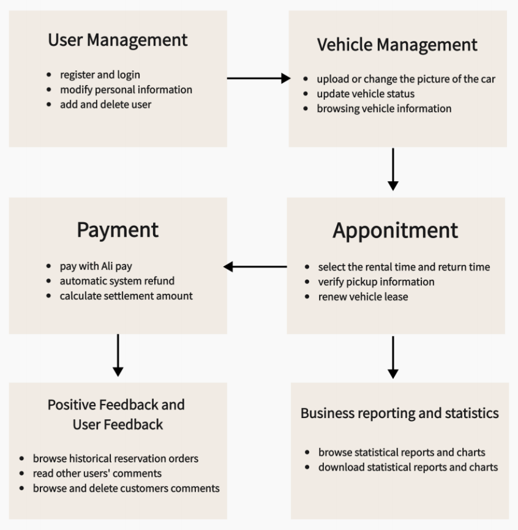

# The description of this Car Rental System project

In the breakdown of our car rental system, we organized it into **six** modules, each further subdivided into specific sub-modules. These include the **User Management Module, Vehicle Management Module, Positive Feedback and User Feedback Module, Appointment Module, Payment Module, and Business Reporting and Statistics Module**. Each module has distinct functionalities, and the seamless interaction between them constitutes the overall system implementation. Our chosen solution adopts the **MVC** architecture, allowing for the independent development, testing, and maintenance of each component. Java, coupled with the SpringBoot framework, was employed to streamline the development and deployment processes. The front-end leverages the Bootstrap framework, while the back-end utilizes the MySQL database. Software testing is a crucial step in ensuring system quality and stability. Our testing eʏforts include unit testing, integration testing, and acceptance testing, aiming to guarantee that all modules and features of the project function correctly and meet user requirements. Below is the system architecture. I have also included a **demonstration video** in the file.

